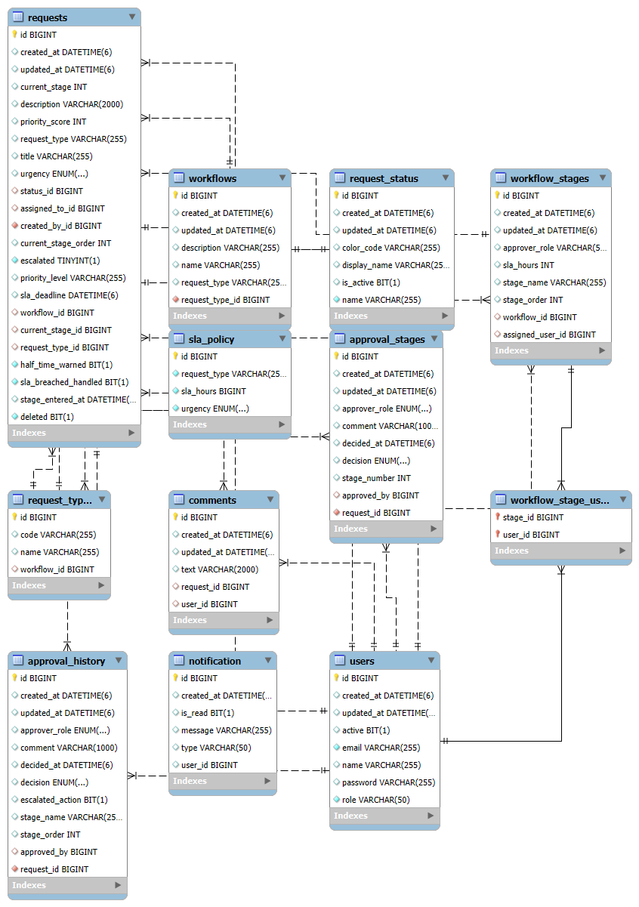

# ReqZen 🚀

**An intelligent internal request management system** for access approvals, IT support, and compliance checks.

---

## 📌 Overview
ReqZen is designed to replace manual emails and basic ticketing systems by:

- Prioritizing requests intelligently  
- Routing them through role-based workflows  
- Providing clear stage-level visibility  
- Maintaining a complete audit trail  

This project has evolved into a **full workflow + SLA + notification system (V4)**.

---

## 🎯 Project Objective
- Automate internal request handling
- Track request status and ownership
- Enable role-based approvals
- Support SLA enforcement and escalation
- Provide foundation for analytics and intelligent routing

---

## 🛠️ Tech Stack

- **Backend:** Java Spring Boot + Spring JPA  
- **Database:** MySQL  
- **Frontend:** React  
- **Security:** Placeholder login (Spring Security planned for future)  

---

## 📊 Phase-Wise Roadmap

| Version | Weeks | Key Deliverables |
|----------|-------|------------------|
| **V1 Core System** | 1 | CRUD, login, request submission, approve/reject |
| **V2 Smart Priority** | 2–3 | Priority scoring, auto-sorting, SLA escalation, keyword analysis |
| **V3 Approval Hierarchy** | 4–6 | Role-based multi-level workflow, dynamic routing, comments |
| **V4 Analytics & Operations** | 7 | Charts, bottleneck detection, metrics, SLA + Notifications |
| **V5 Advanced  | 8 | Email/Push notifications, audit logs |

---

## 🚀 Getting Started

### 1️⃣ Clone the repository
```bash
git clone https://github.com/varsa-varniga/RequestHub-backend.git
````

---

### 2️⃣ Setup MySQL Database

* Create database:

```sql
reqzen_db
```

* Update credentials in:

```
src/main/resources/application.properties
```

---

### 3️⃣ Run Backend (Spring Boot)

```bash
./mvnw spring-boot:run
```

---

### 4️⃣ Run Frontend (React)

```bash
cd frontend
npm install
npm run dev
```

---

### 5️⃣ Access Application

* User dashboard → Create & track requests
* Admin dashboard → Approvals & management

---

## 🧩 Database Design (ER Diagram)

The system database has evolved across versions to support workflow, SLA, and notification features.

### 📌  ER Diagram (V1)

### 📌 Current ER Diagram (V4)


---

## 📌 Notes

* V1 ER diagram removed to avoid outdated schema confusion
* V4 diagram reflects current production-ready structure
* SLA + Notifications fully integrated in latest version

---

## 🚀 Highlights (V4 Improvements)

* SLA-based escalation system implemented
* Notification system integrated into workflow
* Improved request lifecycle tracking
* Enhanced approval hierarchy support
* More scalable database design

---

## 📈 Future Enhancements

* Email/Push notifications
* Advanced analytics dashboard
* AI-based priority prediction
* Microservice decomposition
* Docker deployment

---

💡 *ReqZen is actively evolving into a production-grade workflow management system.*

```

