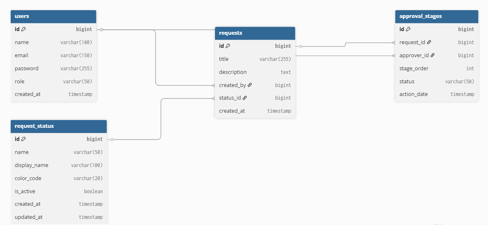

# ReqZen 🚀

**An intelligent internal request management system** for access approvals, IT support, and compliance checks.

---

## **Overview**
ReqZen is designed to replace manual emails and basic ticketing systems by:
- Prioritizing requests intelligently
- Routing them through role-based workflows
- Providing clear stage-level visibility
- Maintaining a complete audit trail

This starter version focuses on setting up the **core system**, CRUD operations, and basic request workflows.

---

## **Project Objective**
- Automate request handling
- Track request status and ownership
- Provide a foundation for priority scoring and SLA enforcement in future versions

---

## **Tech Stack**
- **Backend:** Java Spring Boot + Spring JPA
- **Database:** MySQL
- **Frontend:** React 
- **Security:** Placeholder login (Spring Security integration planned later)

---

## **Phase-Wise Roadmap**

| Version | Weeks | Key Deliverables |
|---------|-------|-----------------|
| **V1 Core System** | 1     | CRUD, login, request submission, approve/reject |
| **V2 Smart Priority** | 2-3   | Priority scoring, auto-sorting, SLA escalation, optional keyword analysis |
| **V3 Approval Hierarchy** | 4-6   | Role-based multi-level workflow, dynamic routing, comments |
| **V4 Analytics & Dashboards** | 7     | Charts, bottleneck detection, metrics for admins |
| **V5 Advanced / Optional** | 8     | Email/Push notifications, audit logs, optional ML/microservice, Docker |

---

## **Getting Started**
1. Clone the repository:
```bash
git clone https://github.com/<your-username>/ReqZen.git
```
2. Set up a MySQL database:
    - Create a database (e.g., `reqzen_db`)
    - Update connection details in `src/main/resources/application.properties`

3. Run the backend (Spring Boot):
```bash
./mvnw spring-boot:run
```
Run the frontend (React):
````
cd frontend
npm install
npm start
````
5. Access dashboards:

User dashboard for creating and tracking requests

Admin dashboard for approvals and request management

# ReqZen

## Phase 1: ER Diagram

### Database Design

